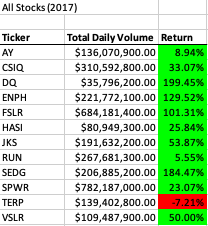
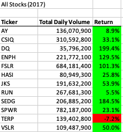
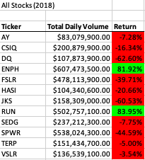
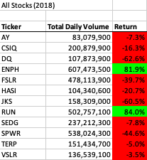
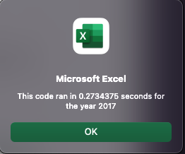
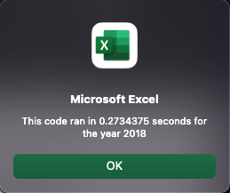
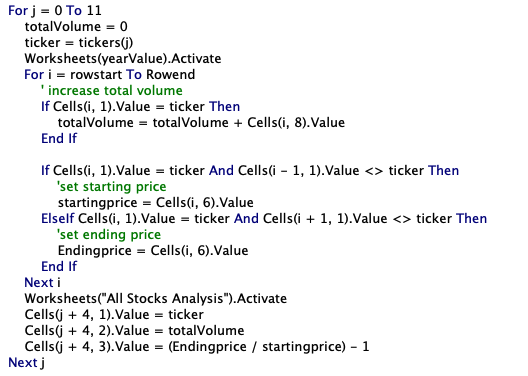
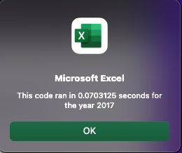
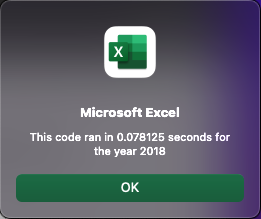
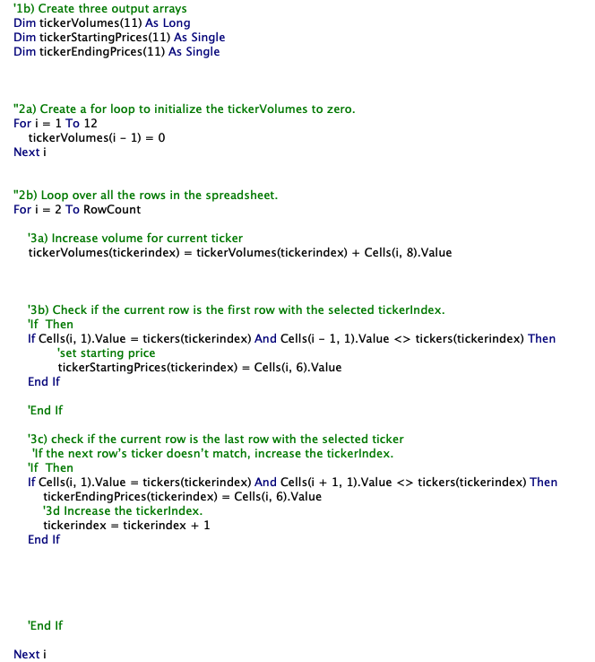

# stock-analysis
Updated Repository since my first attempt ran into issues using git with the excel files

# Stock Analysis

## Overview
The overview for this analysis is two-fold.  First we wanted to help our client be able to quickly show the movement of stock from year start to year end in order to understand what stocks should be considered for investment.  Specifically, we did this by looking at the total volume of stocks traded over the calendar year and also compared the value of each stock at the start of the year and end of the year by looking at the percent change over that time.  Additionally, we also looked at how long it would take our code to run in order to inform our client how long he might expect the code to take for very large datasets.

However, because the time to run was already in the tenths of seconds, which would only get longer as the dataset grew, we decided it was worth going back and trying to determine if there was a more effecient way to complete this task.  In other words we went back to Refactor our code.

## Results
After running the comparisons for our selected stocks (Figures 1-4) there are two takeaways that are readily apparent.  First is that 2017 was in general a better year for stocks as all but one of our stocks was net positive versus only two were next positive in 2018.  The second takeaway from these selected stocks is that our client should more heavily consider investing for stocks _ENPH_ and _RUN_ as these are the only two stocks over this two year period that were net positive for both years and the percentage change either increased or remained fairly high between the two years.  (Please Note that the formatting differences between the original code and refactored code are the result of a skill test within the module asking that we format our code with additional steps).

#### Figure 1: 2017 Stock Outcomes Running Original Code

#### Figure 2: 2017 Stock Outcomes Running Refactored Code

#### Figure 3: 2018 Stock Outcomes Running Original Code

#### Figure 4: 2018 Stock Outcomes Running Refactored Code

Beyond this analysis of the actual stocks themselves, we also wanted to check and see how our code might do if we decided to add many additional stocks.  To get an idea of this, we looked at the time it would take for our code to run from start to finish (Figure 5 and 6).  While the results aren't bad (about .273 seconds), it is worth noting that as the number of stocks to consider goes up the time it takes for our code to run would also increase, and the rate of time increase is worse than the rate for rows added due to us using a nested loop (Figure 7 shows a snapshot of the nested loop used).  This loop has us going through every single row in the dataset for each stock we are considering and since the number of rows increases for every additional stock we consider this is what causes the rate of increase in time to be more dramatic.

#### Figure 5: 2017 Code Timer Results Running Original Code

#### Figure 6: 2018 Code Timer Results Running Original Code

#### Figure 7: Snapshot of the Loop for the Original Code

Because we want to be able to use this template for larger datasets we decided to search for alternative solutions and we eventually realized we could achieve the same outcome and instead only loop through all rows once in total by using a number of arrays to store the values we display in our results.  The achieved times (about .078 seconds) for this new code can be found below in Figures 8 and 9.  The code that runs to achieve these times can be found below in Figure 10. 

#### Figure 8: 2017 Code Timer Results Running Refactored Code

#### Figure 9: 2017 Code Timer Results Running Refactored Code

#### Figure 10: Snapshot of the Loop for the Refactored Code

## Summary
Refactoring code is an important step in the production of any application, tool, or really any code in general.  Refactoring can take the form as it did here of totally changing the nature of the code itself by utilizing an array to store data in order to eliminate a nested loop and save time.  However it can also take the form of turning hard coded values into variables to make the code more dynamic or even going back to improve the readability of our code which saves time for someone in the future if they need to understand how the code is running.

Looking at our code specifically, the most obvious improvement that occured when we refactored the code was the significant time save.  The refactored code ran in hundreths of seconds versus the original nested loop ran in tens of seconds (about 3 times faster) and the difference in time would only increase as we add additional stocks.  For me the only real con of the refactored code compared to our original code was the result of the ease of use of our code.  In my mind loops or more strighforward to understand compared to arrays especially since using these three additional arrays required that we add two small loops, the first to set up our volumes array and then the second to print out our results.

Additionally, I wanted to to take a moment to point out that I don't believe our refactored code is the best solution available.  This is because using the arrays as we have here assumes that the list of stocks is sorted both by date but more importantly by stock type.  If either of these columns in the data was sorted incorrectly the refactored code would fail.  Our original code would also fail in this scenario, however if we work with the assumption that the data is sorted correctly (not to mention sorting could be handled by hand first or even handled at the start of our Macro) then we can completely eliminate the need for the nested loop by saving values directly to the results table once we find the ending stock value, incrementing the index of our stock ticker, and then simply looping to the next row instead of starting back at row 2.  This would also elimnate the additonal small loop used to print out our results.

Also, I wanted to acknowledge that we have not dynamically handled the number of stocks which would make the use of arrays a bit tricky since the dimensions of arrays needs to be set.  We can re-dimension an array if need be but it takes up time and memory to do so.
